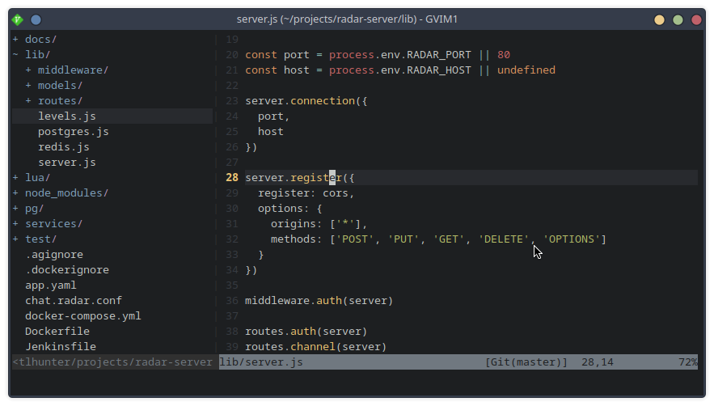

# /home/tlhunter/.vim/vimrc



This Vim configuration is meant to make Vim feel more like an IDE than a simple console-based text editor.
This configuration is optimized for use with GVim though it certainly works in the terminal as well.

## Installation

### Clone with GIT

Run these commands to get this Vim configuration working on your OS X or Linux machine.
You can run `git pull` inside of `~/.vim` if you'd ever like to grab the latest version.

```bash
cd ~
git clone git://github.com/tlhunter/vimrc.git .vim
ln -s ~/.vim/vimrc ~/.vimrc # Optional, needed for some VIM installations
```

### One Time Download

This method might be more sane. Simply downlaod the latest version, extract to `~/.vim`, and configure to your liking.

```bash
wget https://github.com/tlhunter/vimrc/archive/master.zip
```

## Features

* Edit many files at the same time
* File Browser on left side of screen
* Move between files in center screen
* View status of the current GIT repo, if applicable
* Additional features when running under MacVIM
* Quickly navigate to files using a fuzzy finder

### Leader Key

- Space

### Switching between files (Buffers)

* Use `<Leader>q` to close the current file (a different file will appear in its place)
* Use `Ctrl h` `Ctrl l` to move between open files
 * `Ctrl Left` `Ctrl Right` also works for switching between files
 * While in MacVIM, you can swipe left and right to switch between open files
* Use `Cmd Shift N` (or `Alt n` in Linux GVim) to open a new empty buffer

### Viewports (Windows/Splits)

* Use `<Leader>h` `<Leader>j` `<Leader>k` `<Leader>l` to navigate between viewports
* Use `<Leader>Q` to close the current window (you probably won't ever need to do this)
* Use `<Leader>n` to toggle the file browser
* Use `Ctrl P` to perform a recursive fuzzy filename search
* Use `<Leader>a` and type a phrase to search to search based on content within your files (quote and escape if needed)

### File Browser (NERDTree)

* Use `<Leader>n` to toggle the file browser
* Use standard movement keys to move around
* Use `Ctrl j` and `Ctrl k` to move between siblings (aka skip over children in expanded folders)
* Use `C` to make the highlighted node the current working directory
* Use `:Bookmark BookmarkName` to bookmark the current selection
* Use `B` to toggle the bookmark menu
* Use `?` if you'd like some NERDTree documentation
* Use `o` to open the selected file in a new buffer
* Use `t` to open the selected file in a new tab
